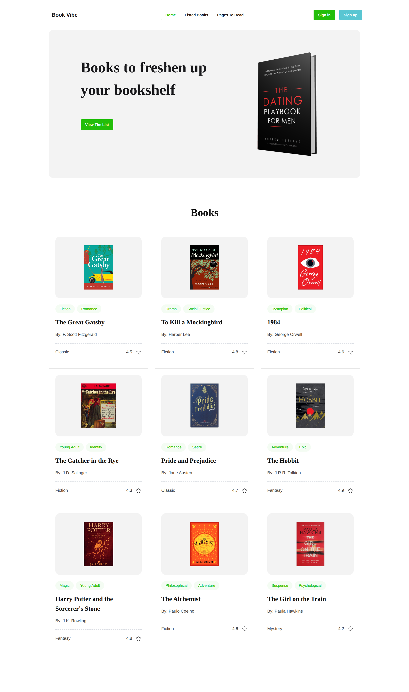

# Book Vibe

A simple React application for browsing books, viewing details, and managing reading lists. The project uses client-side routing and state management to create a clean book browsing experience.

## Screenshot



## Technologies Used

- HTML
- CSS
- JavaScript
- React
- Vite
- React Router

## Features

- Browse a list of books with cover images and details.
- View detailed information for each book.
- Add books to a wish list and a read list.
- Use client-side navigation with React Router.
- Responsive layout for desktop and mobile devices.

## Dependencies

- react
- react-dom
- react-router-dom
- vite

## Run Locally

1. Clone the repository:

```bash
git clone 
```

2. Navigate into the project folder:

```bash
cd book-vibe-code
```

3. Install dependencies:

```bash
npm install
```

4. Start the development server:

```bash
npm start
```

## Links

- Live Demo: https://test-book-vibe.netlify.app/
- GitHub Repository: https://github.com/ShafayatSadid/book-vibe-code
